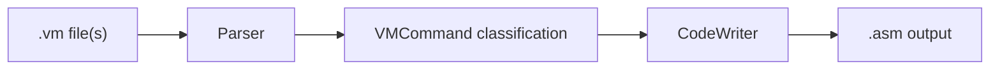

# VMTranslator

This repository contains a nand2tetris VM translator written in Python.

It covers both:

- Project 7: VM I - Stack Arithmetic
- Project 8: VM II - Program Control

The translator takes Hack VM code as input and generates Hack assembly as
output.

## Course Context

Official project pages:

- [Project 7](https://www.nand2tetris.org/project07)
- [Project 8](https://www.nand2tetris.org/project08)

In the nand2tetris toolchain, the VM translator sits between higher-level code
generation and low-level Hack assembly. It translates VM commands into `.asm`
programs that can be executed on the Hack platform.

## What This Repository Does

This translator accepts either:

- a single `.vm` file
- a directory containing multiple `.vm` files

It produces one Hack assembly file:

- `SomeProgram.vm -> SomeProgram.asm`
- `SomeFolder/*.vm -> SomeFolder/SomeFolder.asm`

The implementation supports:

- arithmetic and logical commands
- memory access commands
- branching commands
- function definition
- function call
- function return

Important note: this implementation writes bootstrap code unconditionally and
jumps to `Sys.init`, which matches the final Project 8 behavior.

## Repository Layout

```text
.
├── VMTranslator/
│   ├── VMTranslator.py
│   ├── Parser.py
│   ├── CodeWriter.py
│   └── VMCommand.py
└── VMPrograms/
    ├── Stack Arithmetic/
    └── Program Control/
```

### Main Files

- `VMTranslator/VMTranslator.py`
  CLI entrypoint and translation driver.
- `VMTranslator/Parser.py`
  Reads VM source, skips comments and whitespace, classifies commands, and
  extracts arguments.
- `VMTranslator/CodeWriter.py`
  Emits Hack assembly for each parsed VM command.
- `VMTranslator/VMCommand.py`
  Enum of supported VM command categories.

### Bundled VM Programs

- `VMPrograms/Stack Arithmetic`
  Sample Project 7 VM programs.
- `VMPrograms/Program Control`
  Sample Project 8 VM programs.

These folders contain input `.vm` programs only. They do not include the
official `.tst` and `.cmp` files from the nand2tetris course distribution.

## How To Run

This project uses only the Python standard library. No external dependencies
are required.

Run commands from the repository root with `python3`.

### Translate a Single VM File

```bash
python3 VMTranslator/VMTranslator.py path/to/File.vm
```

This produces a sibling `.asm` file next to the input.

### Translate a Directory of VM Files

```bash
python3 VMTranslator/VMTranslator.py path/to/Directory
```

This produces one assembly file inside the directory, named after the
directory itself.

Example:

```text
MyProgram/
├── Main.vm
├── Sys.vm
└── MyProgram.asm
```

### Examples Using This Repository

Single-file Project 7 program:

```bash
python3 VMTranslator/VMTranslator.py "VMPrograms/Stack Arithmetic/SimpleAdd.vm"
```

Single-file Project 8 program:

```bash
python3 VMTranslator/VMTranslator.py "VMPrograms/Program Control/SimpleFunction.vm"
```

Multi-file Project 8 program:

```bash
python3 VMTranslator/VMTranslator.py "VMPrograms/Program Control/FibonacciElement"
python3 VMTranslator/VMTranslator.py "VMPrograms/Program Control/StaticsTest"
python3 VMTranslator/VMTranslator.py "VMPrograms/Program Control/NestedCall"
```

## Architecture

The translator is split into a parser and a code writer. The parser reads VM
commands and classifies them. The code writer turns each parsed command into the
corresponding Hack assembly sequence.



### 1. Translation Pipeline

The high-level flow in `VMTranslator.py` is:

1. resolve whether the input is a file or a directory
2. create one `CodeWriter` for the output `.asm`
3. for each `.vm` input file:
4. set the current VM file name
5. parse commands one by one
6. dispatch each command to the correct `CodeWriter` method

### 2. Parser

`Parser.py` is responsible for:

- reading VM source line by line
- stripping comments
- stripping whitespace
- skipping empty lines
- classifying the current command
- exposing `arg1()` and `arg2()` when applicable

Supported command categories are represented in `VMCommand.py`.

### 3. Code Writer

`CodeWriter.py` handles all Hack assembly generation.

It includes separate translation logic for:

- arithmetic/logical commands
- `push` / `pop`
- labels and jumps
- function declarations
- calls
- returns

It also tracks:

- the current VM file name for `static` symbols
- the current function name for local label scoping
- unique counters for comparison labels and return labels

### 4. Bootstrap and Program Entry

This implementation always emits bootstrap code at the top of the output file.

The bootstrap code:

- sets `SP = 256`
- initializes `LCL`, `ARG`, `THIS`, and `THAT`
- pushes a bootstrap return address and saved segment pointers
- sets up the initial call frame
- jumps to `Sys.init`

This matches the final Project 8 translator behavior.

### 5. Symbol and Label Scoping

The translator uses scoped names to avoid collisions:

- static variables are emitted as `FileName.index`
- function-local labels are emitted as `FunctionName$Label`
- generated comparison labels are made unique with counters
- generated return labels are made unique per call site

## Supported VM Commands

### Project 7 Commands

Arithmetic and logical commands:

- `add`
- `sub`
- `neg`
- `eq`
- `gt`
- `lt`
- `and`
- `or`
- `not`

Memory access commands:

- `push`
- `pop`

Supported memory segments:

- `constant`
- `local`
- `argument`
- `this`
- `that`
- `temp`
- `pointer`
- `static`

### Project 8 Commands

Branching commands:

- `label`
- `goto`
- `if-goto`

Function commands:

- `function`
- `call`
- `return`

## Running on the Bundled VM Programs

The `VMPrograms/` directory plays the same role as the sample project inputs
from nand2tetris.

### `VMPrograms/Stack Arithmetic`

This folder contains Project 7-style programs:

- `SimpleAdd.vm`
- `StackTest.vm`
- `BasicTest.vm`
- `PointerTest.vm`
- `StaticTest.vm`

These are mostly single-file inputs focused on arithmetic, comparisons, and
memory access.

### `VMPrograms/Program Control`

This folder contains Project 8-style programs:

- `BasicLoop.vm`
- `FibonacciSeries.vm`
- `SimpleFunction.vm`
- `FibonacciElement/`
- `StaticsTest/`
- `NestedCall/`

Some of these are single `.vm` files, while others are directories containing
multiple `.vm` files that must be translated together.

## Official Testing Workflow

The official Project 7 and 8 validation flow uses nand2tetris-supplied test
scripts and compare files in the CPU Emulator.

### Project 7 Validation

Use the official tests for:

- `SimpleAdd`
- `StackTest`
- `BasicTest`
- `PointerTest`
- `StaticTest`

The usual flow is:

1. translate the provided `.vm` program into `.asm`
2. load the generated `.asm` into the CPU Emulator
3. run the supplied `.tst` script
4. confirm that the result matches the supplied `.cmp` file

### Project 8 Validation

Use the official tests for:

- `BasicLoop`
- `FibonacciSeries`
- `SimpleFunction`
- `FibonacciElement`
- `StaticsTest`
- `NestedCall`

The same overall flow applies, but the programs now exercise:

- labels and branching
- function-local variables
- nested calls
- returns
- multi-file translation
- bootstrap setup

## Bootstrap Note

This repository implements the final translator behavior by always emitting
bootstrap code.

That is correct for Project 8, but it matters when thinking about Project 7:

- some early Project 7 exercises conceptually focus only on the translated VM
  commands
- this implementation still prepends bootstrap logic and jumps to `Sys.init`

This implementation always emits bootstrap code, so it behaves like the final
Project 8 translator even when translating Project 7 input programs.

## Code Generation Details

Some implementation details that are useful when reading the code:

- comparison commands like `eq`, `gt`, and `lt` generate unique labels
- `function f k` emits the function label and pushes `0` onto the stack `k`
  times to initialize locals
- `call f n` saves the caller frame, repositions `ARG`, sets `LCL`, and jumps
  to `f`
- `return` restores `THAT`, `THIS`, `ARG`, and `LCL` from the saved frame and
  jumps to the saved return address
- the translator appends a final infinite loop at the end of the generated
  assembly file

## Suggested Workflow

If you want to understand or modify the translator, the most useful order is:

1. start with `VMTranslator/VMTranslator.py`
2. read `VMTranslator/VMCommand.py`
3. read `VMTranslator/Parser.py`
4. read `VMTranslator/CodeWriter.py` in Project 7 order:
   arithmetic and memory access first
5. then read the Project 8 parts:
   labels, jumps, functions, calls, and returns

If you want to validate changes incrementally:

1. start with `VMPrograms/Stack Arithmetic/SimpleAdd.vm`
2. move to `StackTest.vm`, `BasicTest.vm`, `PointerTest.vm`, and `StaticTest.vm`
3. then move to `BasicLoop.vm`, `FibonacciSeries.vm`, and `SimpleFunction.vm`
4. finish with multi-file programs like `FibonacciElement`, `StaticsTest`, and
   `NestedCall`

## References

- [Project 7](https://www.nand2tetris.org/project07)
- [Project 8](https://www.nand2tetris.org/project08)
